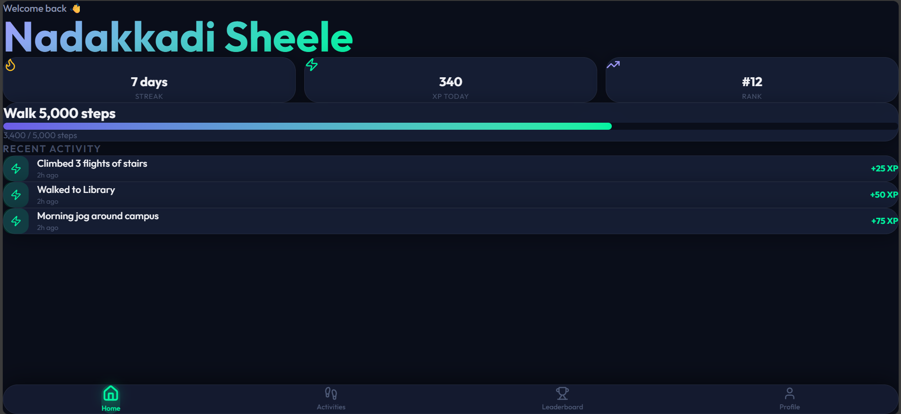
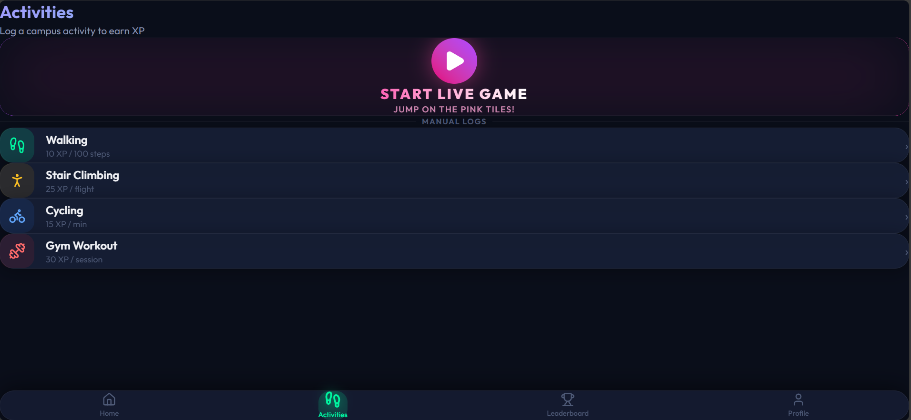
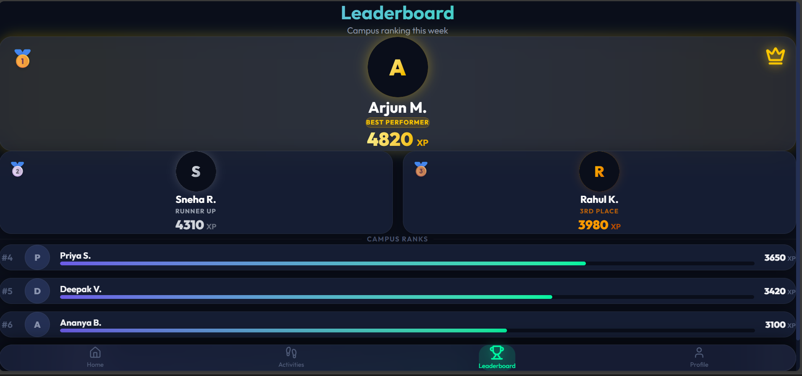
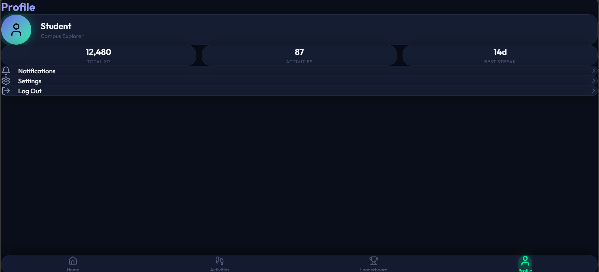
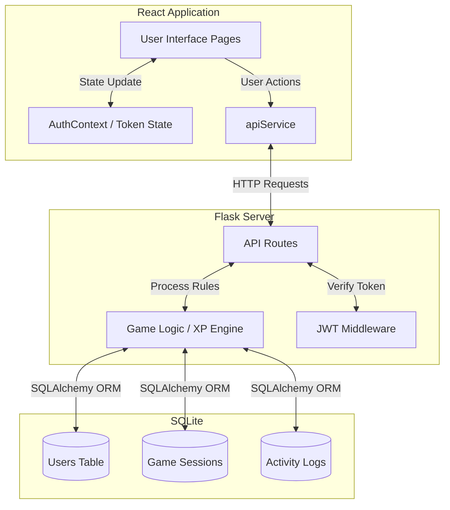

# Nadakkadi Sheele - Campus Game App 🎮

A modern, fully gamified campus activity tracker built with React and Flask. Earn XP, climb leaderboards, unlock achievements, and challenge yourself to reach new levels!

## 📝 Project Description
Nadakkadi Sheele (Campus Game) is an interactive, full-stack web application designed to gamify campus fitness and activity tracking. It combines a dynamic dashboard for tracking daily physical activity with a fast-paced 4-lane rhythm game mode. Users can earn XP, unlock achievements, maintain daily streaks, and compete on the global campus leaderboard. Points are added as XP to find the rank of the user. Points differ according to the activities like walking, running, cycling. 

---

## 💻 Tech Stack
**Frontend:**
- **React 18** - UI Architecture
- **Vite** - Build Tool
- **Tailwind CSS** - Styling and layout
- **Framer Motion** - Smooth animations
- **Lucide React** - Icon library

**Backend:**
- **Python 3 / Flask** - RESTful API
- **SQLAlchemy** - ORM
- **SQLite** - Database (Convertible to PostgreSQL)
- **Flask-JWT-Extended** - Authentication

---

## ✨ Features
1. **Gamification System**: Earn XP, level up (every 1000 XP), and unlock 5+ dynamic achievements based on your activities.
2. **Interactive 4-Lane Game Mode**: A "Piano Tiles" style rhythm game with varying difficulty levels (Easy, Normal, Hard, Insane) and XP multipliers.
3. **Comprehensive User Dashboard**: Track your current streak, overall rank, XP progress, and recent activity history in real-time.
4. **Dynamic Leaderboard**: Compete with other campus players to reach the #1 spot, complete with special top-3 highlight UI.
5. **Secure Authentication**: Full JWT-based login and registration system protecting user profiles and activity data.

---

## 🛠️ Installation Commands

**1. Clone the repository**
```bash
git clone https://github.com/Squirrel04/nadakkadisheelegame
cd nadakkadisheelegame
```

**2. Backend Setup**
```bash
cd backend
python -m venv venv
# On Windows: venv\Scripts\activate
# On Mac/Linux: source venv/bin/activate
pip install -r requirements.txt
```

**3. Frontend Setup**
```bash
# From the root directory
npm install
```

---

## 🚀 Run Commands

**1. Start the Backend Server**
```bash
cd backend
python main.py
```
*The server will run on `http://localhost:5000`*

**2. Start the Frontend Development Server**
```bash
npm run dev
```
*The app will run on `http://localhost:5173`. Open this URL in your browser on mobile phones only `http://172.30.26.56:5173/`.*

hosted website: `https://nadakkadisheelegame.vercel.app/`
---

## 📸 Screenshots

<p align="center">
  
</p>
<p align="center">
  
</p>
<p align="center">
  
</p>
<p align="center">
  
</p>
<p align="center">
  
</p>

*(Note: Replace placeholder images with actual screenshots in the `docs` or `public` folder.)*

---

## 🎥 Demo Video Link
(https://drive.google.com/file/d/1-ZRvrtKgWrM1GoxzY-Oab2s6jA9UZahU/view?usp=sharing)

---

## 🏗️ Architecture Diagram
Below is the high-level architecture of the application, illustrating the flow between the React Frontend, the Flask REST API, and the SQLite Database.



---

## 📖 API Documentation

The backend provides the following RESTful endpoints:

### **Authentication**
- `POST /api/auth/register` - Create a new user account
- `POST /api/auth/login` - Authenticate and receive a JWT token

### **User Operations**
- `GET /api/user/profile` - Fetch current user profile and recent activities
- `PUT /api/user/profile` - Edit profile details
- `GET /api/user/stats` - Fetch comprehensive user statistics
- `GET /api/user/achievements` - List unlocked milestones

### **Game Engine**
- `POST /api/game/start` - Initialize a new game session
- `POST /api/game/end` - Conclude game, process score, perform XP calculation, and award achievements
- `GET /api/game/history` - Retrieve paginated game history

### **Leaderboard & Challenges**
- `GET /api/leaderboard/global` - Retrieve global user rankings based on XP
- `GET /api/leaderboard/weekly` - Retrieve current week's top players
- `GET /api/leaderboard/rank/<user_id>` - Fetch a specific user's leaderboard position
- `GET /api/achievements` - Get list of all available game achievements
- `GET /api/daily-challenge` - Fetch the current daily bonus challenge

---

## 👥 Team Members
- **[Anna Rose Vince]** - Full-Stack Developer - [GitHub](https://github.com/Squirrel04)
- **[TAdheena Basil]** - UI/UX Designer, Backend Engine - [GitHub](https://github.com/Adheena-16)

---

## 📄 License
This project is licensed under the **MIT License**. Check the LICENSE file for details. Feel free to use and modify for your campus or educational purposes!
